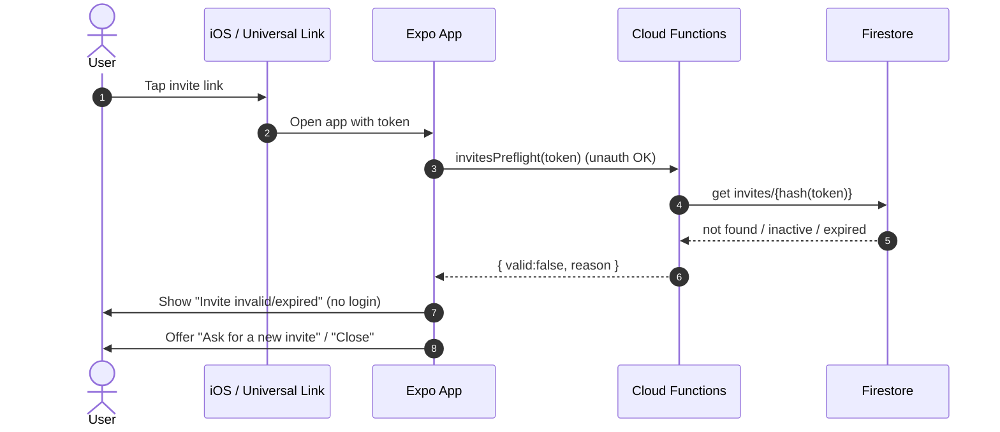

```mermaid
sequenceDiagram
  autonumber
  actor U as User
  participant OS as iOS / Universal Link
  participant APP as Expo App
  participant API as Cloud Functions
  participant DB as Firestore

  U->>OS: Tap invite link
  OS->>APP: Open app with token

  APP->>API: invitesPreflight(token) (unauth OK)
  API->>DB: get invites/{hash(token)}
  DB-->>API: not found / inactive / expired
  API-->>APP: { valid:false, reason }

  APP->>U: Show "Invite invalid/expired" (no login)
  APP->>U: Offer "Ask for a new invite" / "Close"
```